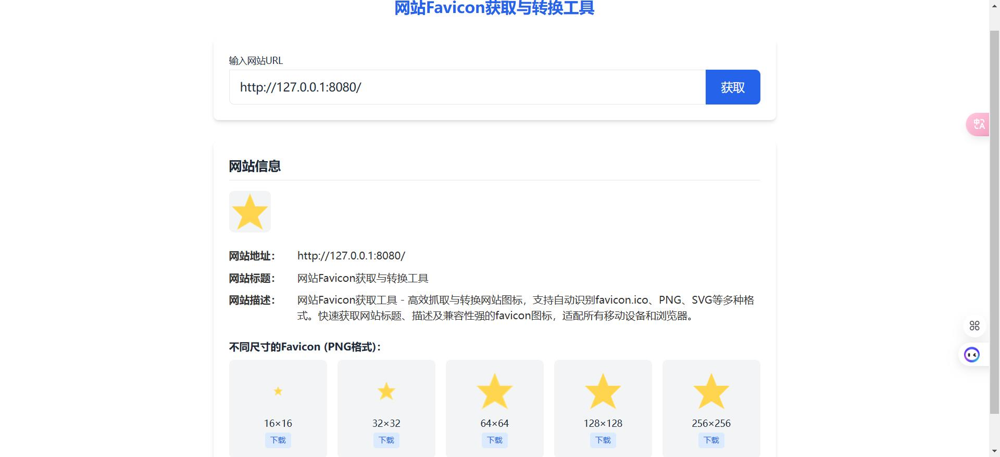

# 网站Favicon获取与转换工具

网站Favicon获取工具 - 高效抓取与转换网站图标，支持自动识别favicon.ico、JPG、PNG、SVG、base64图片等多种格式。快速获取网站标题、描述及兼容性强的favicon图标，适配所有移动设备和浏览器。

## 功能特点

- 高性能
- 兼容性好
- 安装简单

## 安装说明

提前安装好docker、docker-compose命令环境

1. 拉取代码

```bash
#拉取代码
git clone https://github.com/luler/hello_favicon.git
#进入目录
cd hello_favicon
```

2. 启动运行

```bash
docker-compose up -d
```

3. 访问页面：http://127.0.0.1:2025

## 使用说明

1. 在线页面生成
2. 提供接口获取：`POST` /api/favicon

* 请求参数：

```json
{
  "url": "http://127.0.0.1:8080/"
}
```

* 接口返回：

```json
{
  "title": "网站Favicon获取与转换工具",
  "description": "网站Favicon获取工具 - 高效抓取与转换网站图标，支持自动识别favicon.ico、PNG、SVG等多种格式。快速获取网站标题、描述及兼容性强的favicon图标，适配所有移动设备和浏览器。",
  "url": "http://127.0.0.1:8080/",
  "faviconUrl": "http://127.0.0.1:8080/static/favicon.svg",
  "favicons": {
    "16": "data:image/png;base64,iVBORw0KG",
    "32": "data:image/png;base64,iVBORw0KG",
    "64": "data:image/png;base64,iVBORw0KG",
    "128": "data:image/png;base64,iVBORw0KG",
    "256": "data:image/png;base64,iVBORw0KG"
  }
}
```

## 截图展示



## 新增功能
接口地址： GET /api
支持的查询参数：
- 空参数名（如 ?=https://www.baidu.com ）
## 使用示例
你现在可以在浏览器中直接访问：

```
http://localhost:3000/api?url=https://www.baidu.com
```
### 返回的JSON格式
```
{
  "title": "百度一下，你就知道",
  "description": "全球领先的中文搜索引擎、致力于让网民更便捷地获取信息，找到
  所求。",
  "url": "https://www.baidu.com",
  "faviconUrl": "https://www.baidu.com/favicon.ico"
}
```
### 实现的功能特性
1. CORS支持 - 支持跨域请求
2. 自动协议补全 - 自动为没有协议的URL添加 https://
3. 智能Favicon获取 - 自动查找网站的favicon，如果找不到则提供默认图标
4. 错误处理 - 完善的错误处理和状态码返回
### 重试机制应用
不仅在主要的网站信息获取中使用重试，还在图像获取函数 fetchAndDecodeImage 中也应用了重试机制：
- 图像获取重试 : 最多重试2次，间隔1秒
- 网站信息获取重试 : 最多重试3次，间隔3秒